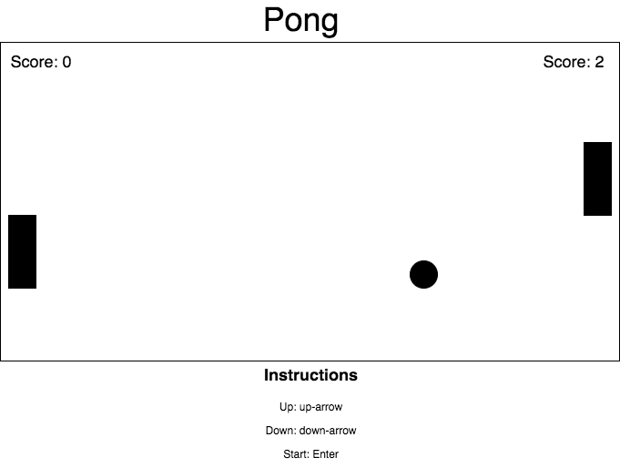

## Pong

### Background

Pong is one of the earliest arcade games, originally released in 1972.
The game simulates table tennis. There are paddles on the left and right sides
of the screen, and players can only move the paddles up and down.  The balls
bounce between the two paddles and you win when the ball gets past your
opponents paddle.

### Functionality & MVP  

With this Conway's Game of Life simulator, users will be able to:

- [ ] Start the game
- [ ] Play to a score of 3
- [ ] Play against a computer

In addition, this project will include:

### Wireframes

This app will be very simple, it will just be a single screen, mostly rendered
by canvas.

### Architecture and Technologies

This project will be implemented with the following technologies:

- Vanilla JavaScript
- `HTML5 Canvas` for DOM manipulation and rendering,

### Implementation Timeline

**Day 1**: Do Canvas Tutorial, review Asteroids project, layout file structure

Goals for the day:
- Be able to animate and draw html elements on the page
- Understand solution for Asteroids project with moving objects
- Create file structure for project

**Day 2**: Draw and style the board and get the ball to move

Goals for the day:
- Choose color scheme and fonts for page
- Draw board, paddles, ball
- Get ball to move

**Day 3**: Get ball to bounce (boundaries), user controls, advanced styling

Goals for the day:
- Get ball to move properly when it hits a paddle
- Get paddles to move on keypress
- Add 1-2 unique styling features that make this game unique

**Day 4**: Create AI, implement scoring

Goals for the day:
- Make an AI that's competitive
- Implement score count and win message upon reaching the winning score

### Bonus features

- Music/sound
- More visual effects for ball (animation when scoring or hitting paddle)
- Different difficulty levels
- Human player instead of computer
